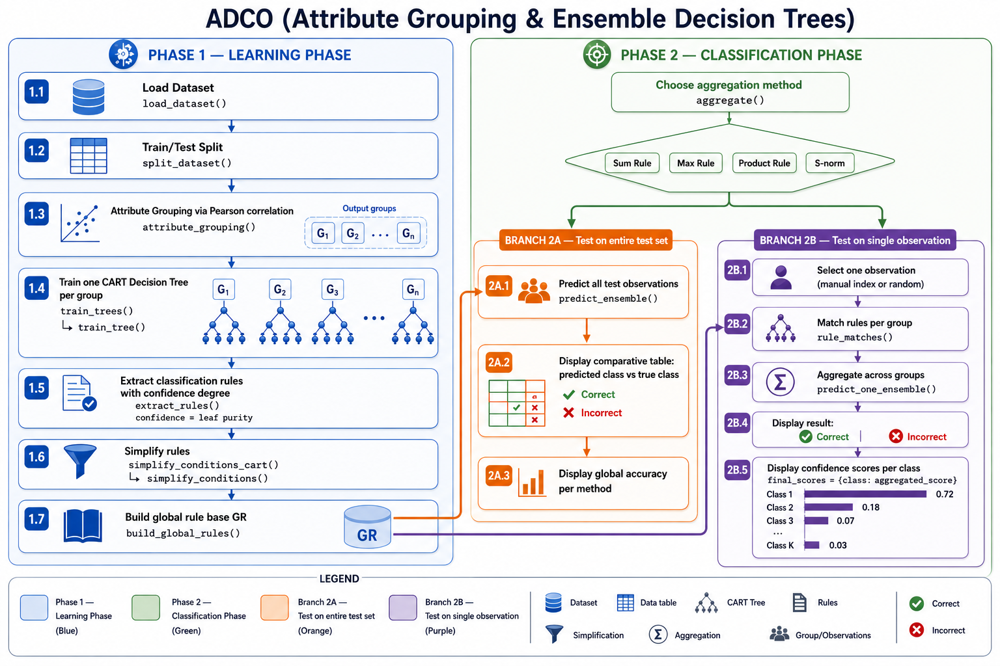

# ADCO — Attribute Grouping & Ensemble Decision Trees

## Overview

ADCO is a classification method that extends the attribute grouping ensemble approach to decision trees (CART).

The attribute grouping strategy is inspired by the SIFCO fuzzy ensemble approach (Soua et al., 2012), which groups linearly correlated attributes using Pearson correlation, then trains one classifier per group and combines their outputs. ADCO replaces the fuzzy classifiers with CART decision trees and proposes confidence-based aggregation methods to combine predictions across groups.

The pipeline works as follows:

**Phase 1 — Learning**
1. Load dataset and split into train/test sets
2. Group correlated attributes using Pearson linear correlation (SIFCO method)
3. Train one CART decision tree per attribute group
4. Extract classification rules from each tree with a confidence degree
5. Simplify rules (remove redundancies, detect contradictions)
6. Build the global rule base GR — formally: GR = R₁ ∪ R₂ ∪ ... ∪ Rₙ where Rᵢ is the rule base of group Gᵢ

**Phase 2 — Classification**
- **2A — Test on entire test set**: predict all test observations, display comparative table with accuracy per method
- **2B — Test on single observation**: predict one observation, display confidence scores per class for each aggregation method

---

## Pipeline


*Diagram generated by ChatGPT (OpenAI, 2026) and reviewed by the author.*

## Project Structure

```
ADCO/
│
├── data_loader.py          # Dataset loading and train/test splitting
├── utils.py                # Shared utilities:
│                           #   get_numeric_features()
│                           #   simplify_conditions()      — generic, any classifier
│                           #   simplify_conditions_cart() — CART-specific wrapper
├── CO.py                   # Attribute grouping via Pearson correlation
│
├── ADCO_tree.py            # Single CART tree: training and rule extraction
│                           #   train_tree()    — trains one DecisionTreeClassifier
│                           #   extract_rules() — extracts rules with confidence degree
│
├── ADCO_EM.py              # Ensemble method: one tree per group
│                           #   train_trees()        — calls train_tree() per group
│                           #   build_global_rules() — merges all group rule bases into GR
│
├── ADCO_aggregation.py     # Low-level aggregation operators
│                           #   sum_rule(), max_rule(), product_rule(), s_norm()
│                           #   aggregate() — dispatcher for all methods
│
├── ADCO_confidence.py      # Ensemble prediction using aggregation strategies
│                           #   rule_matches()         — checks if a rule fires on an observation
│                           #   predict_one_ensemble() — predicts one observation
│                           #   predict_ensemble()     — predicts all test observations
│                           #   accuracy_ensemble()    — computes global accuracy
│
├── ADCO_one.py             # Baseline: single decision tree on all attributes
│                           #   train(), predict_single(), accuracy_single()
│
├── test_ADCO.py            # Unit tests (unittest, 29 tests)
│
├── interface_tk.py         # Desktop interface (Tkinter)
└── interface_st.py         # Web interface (Streamlit)
```

---

## Rule Structure

Each extracted rule has the following structure:

```python
{
    "conditions": [
        {"feature": "petal_length", "op": ">",  "threshold": 2.45},
        {"feature": "petal_width",  "op": "<=", "threshold": 1.75}
    ],
    "class":      "versicolor",   # predicted class
    "confidence": 0.9074,         # leaf purity (see below)
    "support":    54,             # number of training samples reaching the leaf
    "group":      "G1"            # source group in GR
}
```

A rule fires on an observation if **all conditions are satisfied**.

---

## Confidence Degree

The confidence of a rule is defined as the **leaf purity** of the corresponding CART decision tree leaf:

```
confidence(rule) = nb of correctly classified samples in leaf
                   ─────────────────────────────────────────
                   total samples reaching the leaf
```

**Important:** this is a local empirical accuracy measure — not a calibrated probability, not a Bayesian probability, and not a fuzzy confidence degree. It reflects how pure the leaf is on the training set.

> **Note:** Since confidence is computed on the training set, values may be optimistic. A stratified train/test split (default 80/20) is applied to mitigate this.

---

## Aggregation Methods

For each observation, the matching rule with the highest confidence is selected per group. Confidences are then aggregated across groups using one of the following methods:

| Method | Formula | Range | Reference |
|---|---|---|---|
| **Sum** | `Σ confidence` | [0, +∞) | Kittler et al., 1998 |
| **Max** | `max(confidence)` | [0, 1] | Kittler et al., 1998 |
| **Product** | `Π confidence` | [0, 1] | Kittler et al., 1998 |
| **S-norm** | `a + b - a×b` (iterative) | [0, 1] | Dubois & Prade, 1985 |

The class with the highest aggregated score is the final prediction.

> **Note on Product Rule:** it penalizes classes activated by multiple groups since each multiplication reduces the score. It performs best when classifiers are independent, which is not guaranteed here.

---

## Installation

**Requirements:** Python 3.8+

```bash
pip install -r requirements.txt
```

---

## Usage

### Desktop interface (Tkinter)
Open the project folder in VSCode, then open `interface_tk.py` and click the **▷ Run** button.

Alternatively, double-click `interface_tk.exe` if available (no Python required).

### Web interface (Streamlit)
Open a terminal and run:
```bash
streamlit run interface_st.py
```

---

## Interface

Both interfaces provide:
- Load a dataset (CSV file or built-in sklearn datasets: iris, wine, breast_cancer)
- Select the target column from a dropdown list
- Set the correlation threshold and test set size
- Choose aggregation methods via checkboxes (sum, max, product, s-norm, single tree)

**Tab 1 — Groups & Rules**: attribute groups formed and all extracted rules with confidence and support

**Tab 2 — Comparative Results** (Phase 2A): color-coded table for all test observations
- 🟢 Green = correct prediction
- 🔴 Red = incorrect prediction
- Accuracy per method at the bottom

**Tab 3 — Observation Test** (Phase 2B): detailed view for one observation
- Observation values with target column highlighted
- Predicted class per method with ✔/✘
- Aggregated confidence scores per class (`final_scores`)

---

## Supported Datasets

| Dataset | Source | Instances | Attributes | Classes |
|---|---|---|---|---|
| Iris | sklearn | 150 | 4 | 3 |
| Wine | sklearn | 178 | 13 | 3 |
| Breast Cancer | sklearn | 569 | 30 | 2 |
| Any CSV file | user-provided | — | — | — |

---

## Running Tests

```bash
python -m unittest test_ADCO -v
```

29 unit tests covering: dataset loading, train/test split, attribute grouping, condition simplification, rule extraction, and global rule base construction.

---

## Contributions

- Extension of SIFCO-style attribute grouping to CART decision trees
- Confidence-based rule extraction from CART leaves (leaf purity as confidence degree)
- Multi-group ensemble aggregation strategies (Sum, Max, Product, S-norm)
- Comparative evaluation against a single-tree baseline
- Dual evaluation modes:
  - **2A** — full test-set evaluation with comparative accuracy table
  - **2B** — single-observation explainable prediction with confidence scores per class

---

## References

- Soua, B., Borgi, A., & Tagina, M. (2012). *An ensemble method for fuzzy rule-based classification systems.* Knowledge and Information Systems. doi:10.1007/s10115-012-0532-7
- Kittler, J. et al. (1998). *On combining classifiers.* IEEE Transactions on Pattern Analysis and Machine Intelligence, 20(3), 226–239.
- Dubois, D., & Prade, H. (1985). *Théorie des possibilités.* Masson, Paris.
- Dieterich, T.G. (2000). *Ensemble methods in machine learning.* Multiple Classifier Systems, Springer. doi:10.1007/3-540-45014-9_1
- Ben Slima, I., & Borgi, A. (2018). *Supervised methods for regrouping attributes in fuzzy rule-based classification systems.* Applied Intelligence, 48(12), 4577–4593.
